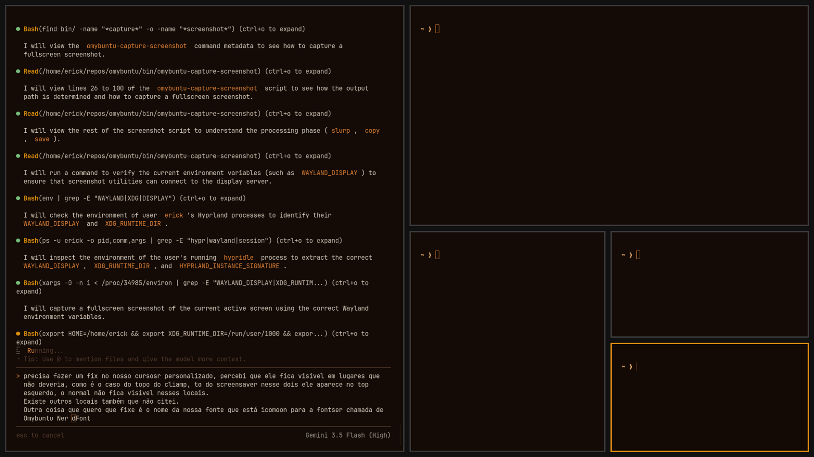

# Omybuntu

<p align="center">
  
</p>

Omybuntu is an unofficial, highly optimized port of Omarchy and Omakub designed specifically for the Debian/Ubuntu ecosystem. It maintains the original philosophy of creating an opinionated, beautiful, and developer-focused desktop environment using tiling window managers, while delivering rock-solid stability and modern package compatibility on Ubuntu bases.

---

## Key Features

* **Window Manager**: Pre-configured Hyprland session offering smooth animations, tiling, and keyboard-centric window layouts.
* **Modern Shell & Terminal**: Foot terminal emulator configured with Starship prompt, zoxide, eza, fzf, lazygit, tmux, and btop.
* **Multilingual Installer**: Interactive installation wizard supporting English, Portuguese (Brasil), and Spanish.
* **Theme Support**: Over 20 curated themes (Catppuccin, Gruvbox, Tokyo Night, Nord, and more) switchable instantly.
* **Modular CLI**: Command-line interface with a clean route manager that handles all configuration, updates, packages, and theme changes under the unified `omybuntu` command.
* **TUI Apps**: Integrated lightweight terminal user interfaces for system operations including Impala (Wi-Fi), Bluetui (Bluetooth), Wiremix (Audio), and Cliamp (Audio playback).
* **Automated Migration System**: Automated timestamp-based configuration migrations that run transparently during repository updates.

---

## Project Architecture and Components

The repository is organized to separate defaults, user configurations, automation scripts, and command-line helpers.

### 1. Modular Command Routing (bin/omybuntu)
Instead of forcing users to remember individual helper scripts, Omybuntu provides a main binary (`bin/omybuntu`) that scans the `bin/` directory and exposes command routes. Commands use a structured prefix naming scheme:
* `cmd-`: General CLI check utilities.
* `capture-`: Screenshot, screen recording, and text-extraction tools.
* `pkg-`: Package management helper functions.
* `hw-`: Hardware and device feature detection.
* `refresh-`: Tools to copy/reset default configuration templates to the user space.
* `install-`: Installers for optional developer tools, browsers, and game launchers.
* `launch-`: Application launchers and runners.
* `theme-`: Theme settings, background switchers, and template renderers.
* `update-`: Systems and keyring updater scripts.

To run a sub-command, you can execute:
```bash
omybuntu theme set gruvbox
```

### 2. Configuration & Theme System
* **Templates**: Located in `default/themed/*.tpl`, these files contain placeholders like `{{ accent }}` or `{{ background }}`.
* **Color Definitions**: Found in `themes/*/colors.toml`, specifying colors for every themed element.
* **Refresh Pattern**: When a theme is updated, the template renderers read the theme definitions and dynamically rewrite configuration files for Waybar, Foot, Hyprland, Hyprlock, Kvantum, and GDM/SDDM.
* **Hyprland Configuration**: Note that Omybuntu uses `.conf` files for Hyprland configuration (unlike Omarchy, which uses `.lua`). This is a deliberate choice; we will maintain the `.conf` format until the Ubuntu packages for Hyprland are updated to fully support Lua.
* **Config Overwrites**: The utility `omybuntu-refresh-config` copies default templates under `config/` to the user's `~/.config/` with automatic backups.

### 3. Integrated Launchers & TUIs
Omybuntu downloads and configures external launcher engines and TUIs during the setup process:
* **Walker**: A fast, extendable application runner.
* **Elephant**: A highly pluggable keyboard launcher.
* **Impala**: Terminal-based Wi-Fi management utility.
* **Bluetui**: Terminal-based Bluetooth management.
* **Wiremix**: Audio mixer TUI.
* **Cliamp**: Lightweight music player.

### 4. Timestamp-based Migrations
To ensure configuration consistency when pulling updates, Omybuntu contains a migration framework under `migrations/`. Migrations are:
* Sourced sequentially rather than executed directly.
* Named after the Unix timestamp of the last commit.
* Used to patch user configuration files, remove old packages, or perform one-off repair work without user intervention.

---

## Theme Gallery

Omybuntu comes preconfigured with beautiful dark and light themes. Previews of some popular styles:

<table align="center">
  <tr>
    <td align="center"><b>Catppuccin</b><br/></td>
    <td align="center"><b>Gruvbox</b><br/></td>
  </tr>
  <tr>
    <td align="center"><b>Tokyo Night</b><br/></td>
    <td align="center"><b>Nord</b><br/></td>
  </tr>
</table>

---

## Installation Options

### 1. Via Installation Script (On an existing Ubuntu System)

To install Omybuntu directly on an active, clean Ubuntu installation, execute the boot script using curl or wget:

```bash
bash -c "$(curl -fsSL https://raw.githubusercontent.com/erickdevit/omybuntu/master/boot.sh)"
```

Alternatively, you can use wget:

```bash
wget -qO- https://raw.githubusercontent.com/erickdevit/omybuntu/master/boot.sh | bash
```

To target a specific branch or a custom fork for deployment, specify `OMYBUNTU_REPO` and `OMYBUNTU_REF` environment variables:

```bash
OMYBUNTU_REPO="erickdevit/omybuntu" OMYBUNTU_REF="master" bash -c "$(curl -fsSL https://raw.githubusercontent.com/erickdevit/omybuntu/master/boot.sh)"
```

### 2. Ready-to-Run ISO (Coming Very Soon)

For a streamlined bare-metal deployment, we are building a custom Omybuntu ISO installer.
* **Direct Boot**: Boot straight into the installer which configures Ubuntu and Hyprland without requiring an existing GNOME/Ubuntu Desktop installation.
* **No Bloat**: Avoids standard GNOME packages, installing only what is defined in the Omybuntu base package lists.
* **Rapid Deployment**: Incorporates custom chroot scripts to prepare system storage quickly.
* **Status**: The ISO generation scripts are in active development and testing. The official .iso image will be made available for download very soon.

#### GitLab ISO Builds

ISO builds run on the [Omybuntu GitLab project](https://gitlab.com/erickwornex/omybuntu). Maintainers can start a pipeline manually from the `dev` branch, while version tags matching `v*` start a build automatically. Successful pipelines publish the ISO and its SHA-256 checksum to the GitLab Generic Package Registry.

---

## Acknowledgements & Origin (Créditos)

Omybuntu would not exist without the incredible work of the projects it builds upon. **All conceptual credit, design philosophy, and thousands of hours of initial development belong to the original creators:**

* **[Omarchy](https://github.com/basecamp/omarchy)**: Omybuntu is a direct fork and port of Omarchy. We owe our entire foundation to the Omarchy contributors who built the Arch-based vision.
* **[Omakub](https://omakub.org/)**: The original visionary project created by David Heinemeier Hansson (DHH) and the Basecamp team. Omakub set the gold standard for what a beautiful, modern, and opinionated Linux distribution should look and feel like.

Omybuntu aims to be a faithful continuation of this vision, bridging the gap between Omarchy's bleeding-edge Arch architecture and the widespread accessibility of Ubuntu.

---

## Contributing

We welcome contributions! Please see our [Contributing Guidelines](CONTRIBUTING.md) for details on our professional workflow, issue templates, and pull request standards.

## License

Omybuntu is released under the [MIT License](https://opensource.org/licenses/MIT).
