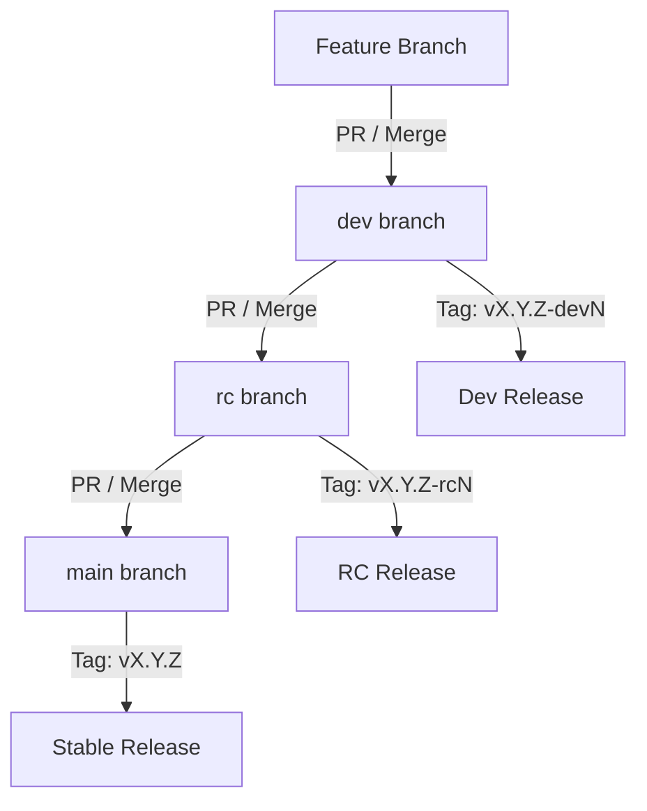

# Omybuntu Releases and Update Channels

This document defines the release cycle, branching strategy, versioning conventions, and update channel mechanisms for Omybuntu. It serves as the source of truth for both developers and agentic AI systems working on the codebase.

---

## 1. Branching Strategy and Channels

Omybuntu supports four update channels. Each channel corresponds to a specific Git branch and package stability target:

| Channel | Git Branch | Version Tag Pattern | Stability | Description |
|---|---|---|---|---|
| **Stable** | `main` | `vX.Y.Z` (e.g., `v3.5.0`) | Production | Fully verified releases. |
| **Edge** | `main` | `vX.Y.Z` (e.g., `v3.5.0`) | Rolling | Stable Omybuntu code but tracking rolling-edge upstream system packages. |
| **RC** | `rc` | `vX.Y.Z-rcN` (e.g., `v3.5.0-rc1`) | Pre-release | Release candidates for community validation. |
| **Dev** | `dev` | `vX.Y.Z-devN` (e.g., `v3.5.0-dev2`) | Experimental | Active development branch. May be unstable. |

---

## 2. Release Promotion Flow

Code propagates through the branches sequentially using Pull Requests (PRs) and automated or manual Git tagging:



### Flow Details:
1. **Active Development:**
   - All feature development and bug fixes are committed to feature branches and merged into the **`dev`** branch via Pull Requests.
   - Developers tag stable points on `dev` as `vX.Y.Z-devN` to trigger experimental updates for Dev channel users.
2. **Release Candidate (RC) Testing:**
   - When features are mature, `dev` is merged into the **`rc`** branch via a Pull Request.
   - The branch is tagged as `vX.Y.Z-rcN` to push updates to RC channel users.
3. **Production Release:**
   - Once the RC is verified as stable, the `rc` branch is merged into the **`main`** branch via a Pull Request.
   - The branch is tagged with a clean semver tag (e.g., `vX.Y.Z`) to release to Stable and Edge channel users.

---

## 3. Local Version Detection and Upgrade Flow

### How Update Detection Works
The utility `omybuntu-update-available` runs on a schedule (e.g., every 6 hours via Waybar) and determines if an update is available for the user's active channel:
1. **Retrieve Active Channel:** Read from `~/.local/state/omybuntu/channel` (falls back to the current local Git branch if unset).
2. **Fetch Remote Tags:** Pull remote tags from `origin` via `git ls-remote --tags origin`.
3. **Filter Tags by Channel:**
   - **Stable/Edge:** Matches `v*` but excludes any tag containing `-rc` or `-dev`.
   - **RC:** Matches `v*-rc*`.
   - **Dev:** Matches `v*-dev*`.
4. **Compare Tags:** If the latest remote tag matching the pattern differs from the latest local tag reachable from the active branch, an update is signaled.

### How the Upgrade Executes
When the user triggers `omybuntu update`:
1. The local repository performs a git pull on the active branch:
   ```bash
   git -C $OMYBUNTU_PATH pull --autostash
   ```
2. Any configuration migrations are executed sequentially from the `migrations/` directory based on timestamps.
3. System packages are updated via APT:
   ```bash
   sudo apt-get update && sudo apt-get upgrade -y
   ```
